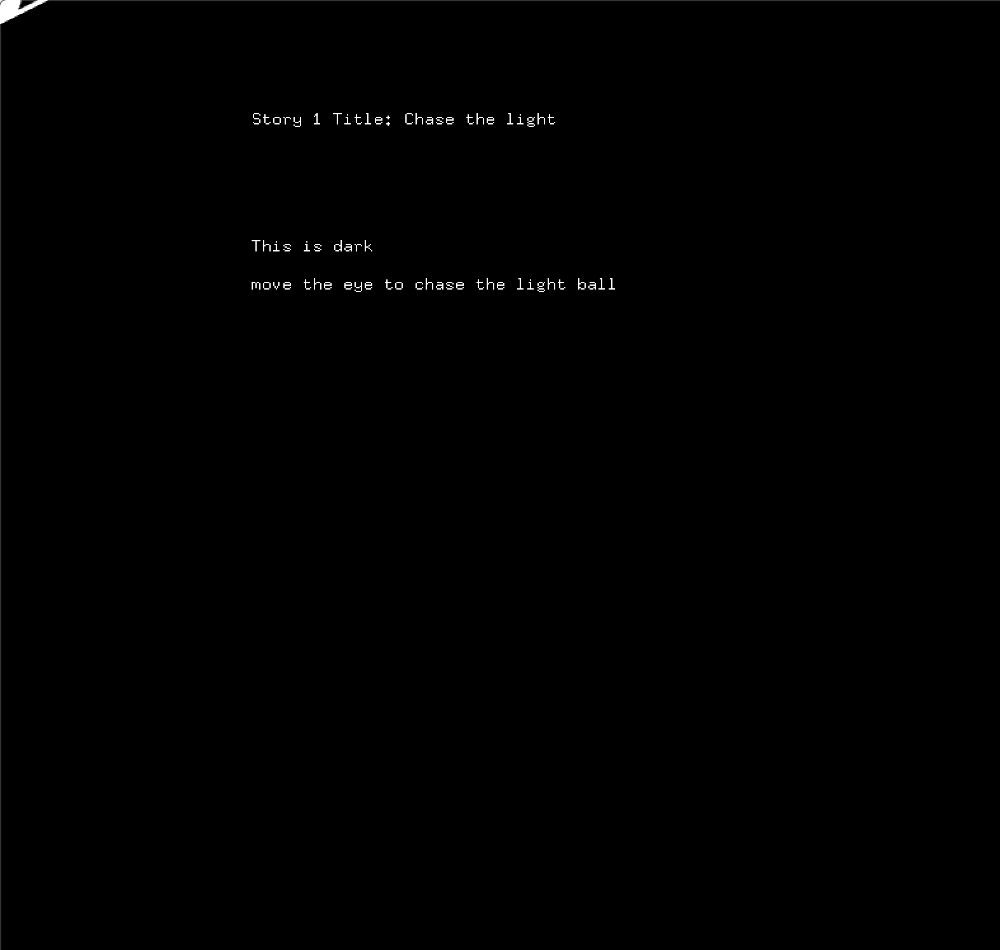
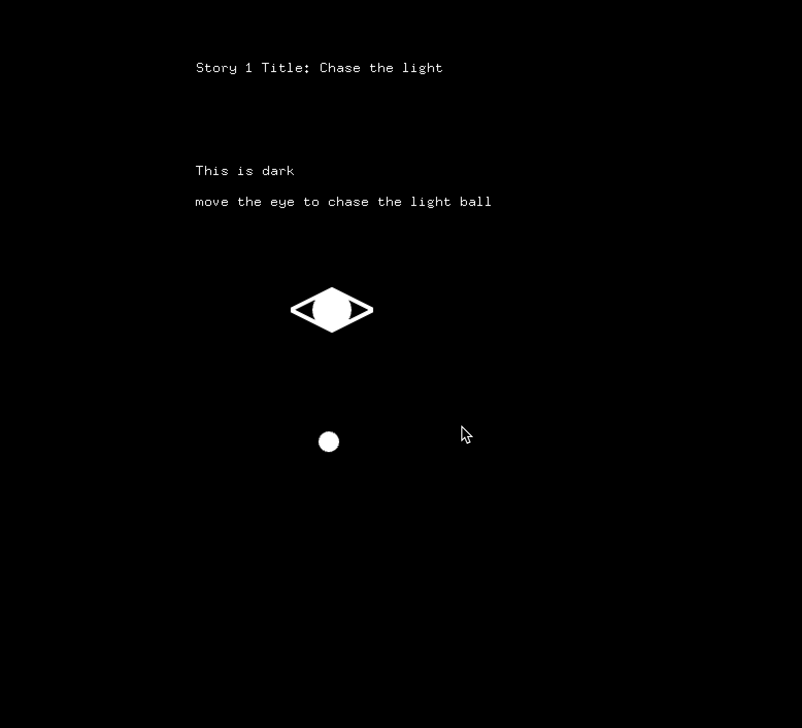

# Assignment6
## This is a story about eye want to chase the light in the dark. in this scene, the eye can never truly touch the light.
### Screenshots
### begin stage

 
### mouse click, a light ball appear

 

### mouse drag or move arrow, the eye move the desinated location

 

**Link to Youtube video:**

