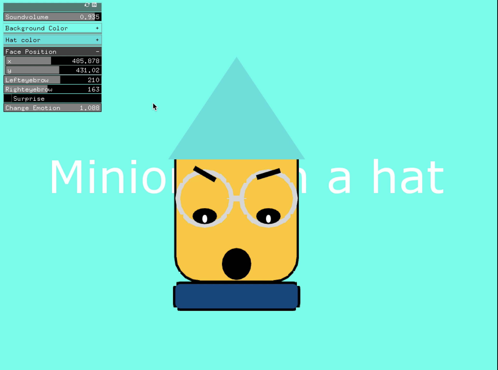

# Assignment7
## I refined my face from last week to a minion. I also have figured out the reason why it was flashing last week, becuase I put the ofPath gloablly not locally. Music credit to "Minion Banna song".
 
What are the first 4 arguments of the slider setup method?
 
From the guiExample .h file, what types of sliders are available?
   ofxFloatSlider, ofxColorSlider, ofxVec2Slider, ofxIntSlider, ofxToggle, ofxButton, ofxButton, ofxLabel, ofxPanel, ofSoundPlayer.
  
If the difference between them is in their return value, what do they return and how does this affect the values you can pass to setup?
  The value in the setup will change to the return value.

### Screenshots
### begin stage

 
### change background color and the position of eyebrow

 

### change emotion by using scale

 

### change emotion by clicking button

 

**Link to Youtube video:**

