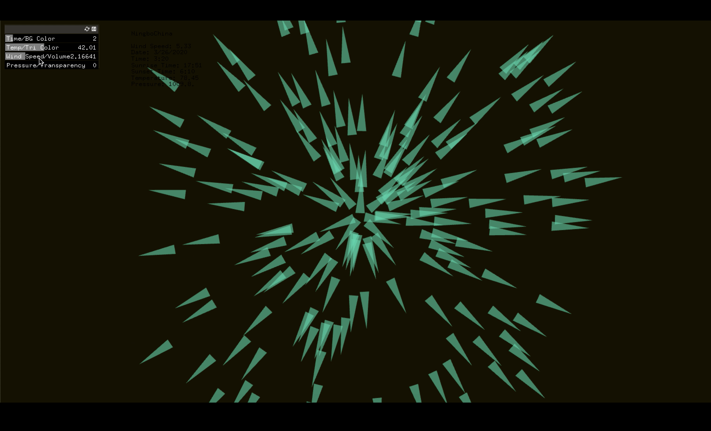
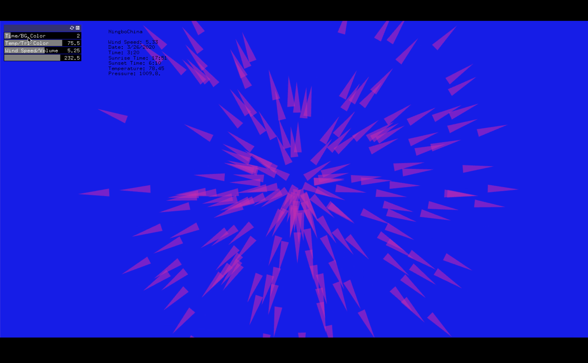
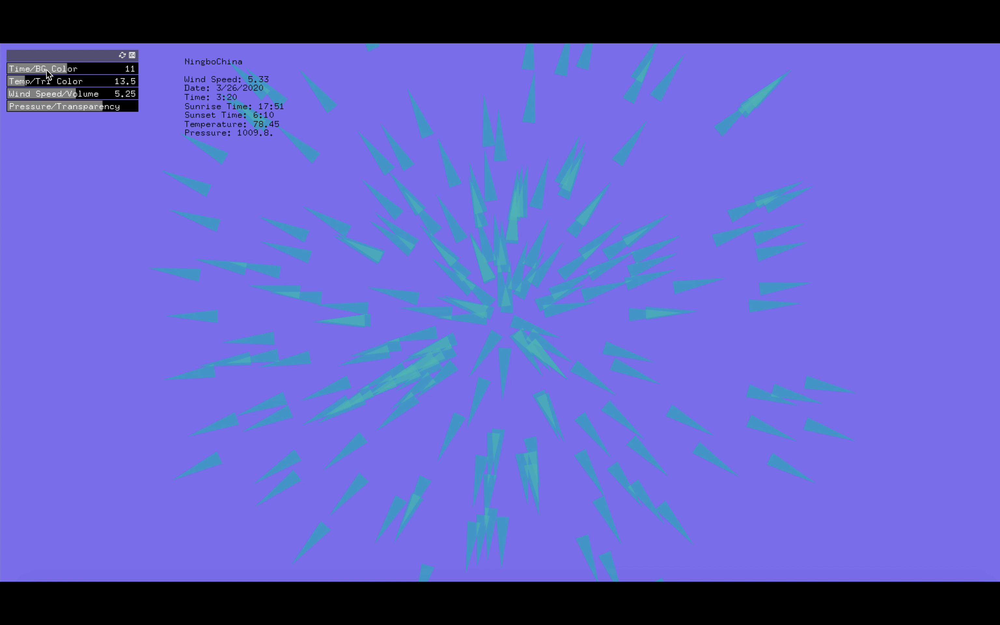
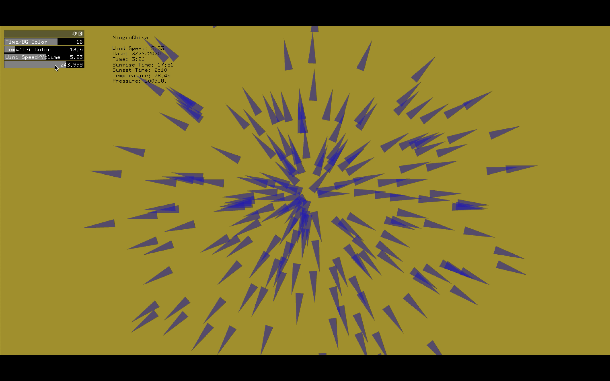

# Assignment8
## I created an abstract visualization by using the data of my hometwon city Ningbo.

### Screenshots
### The background color is controlled by the time

 
### The triangles colors are controlled by the temperature

 

### The transparency of the background is controlled by the pressure

 

### The background music volume is controlled by the windspeed

 

**Link to Youtube video:**

