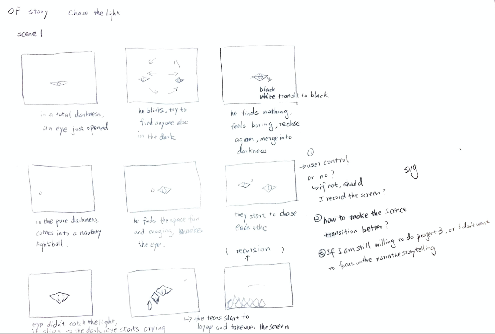
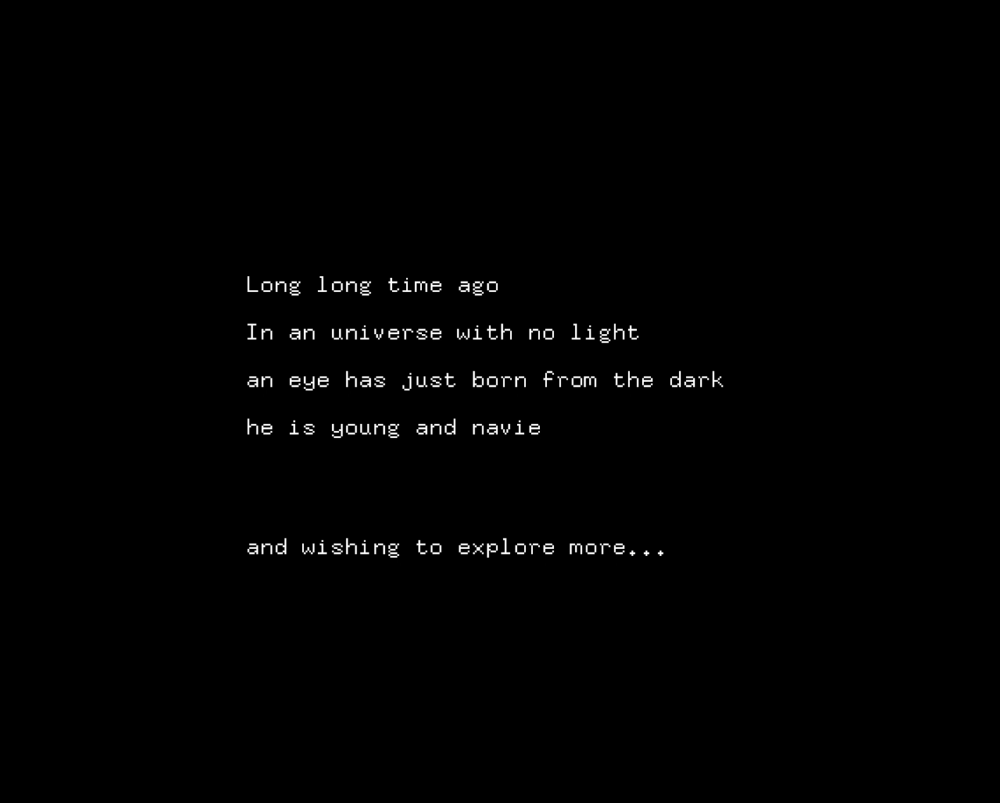
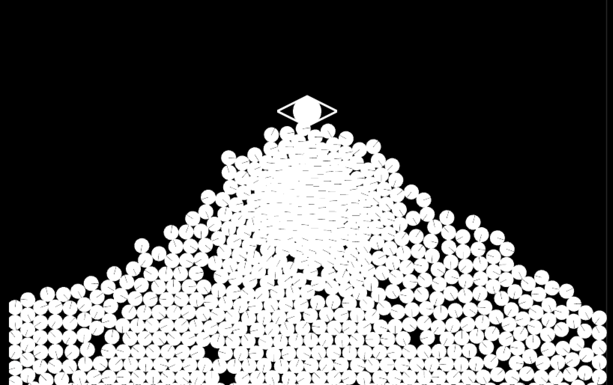

# Project1
## Project concept
### This project aims to tell a short story about an eye has born in the mother darkness and he wants to chase the light. One day, a light dot accidentally comes into his life and he starts to play with the light. In the end, he didn’t realize that light is Pandora’s box. He successfully have the light, but there is no darkness anymore. 

### Screenshots
### brainstorm

 
### 

 
### 

 

### 

 

**Link to Youtube video:**

