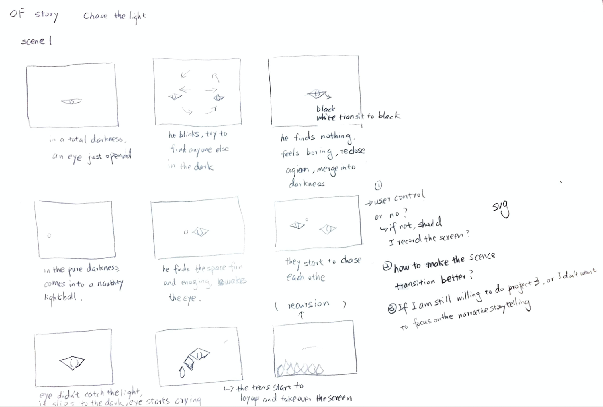
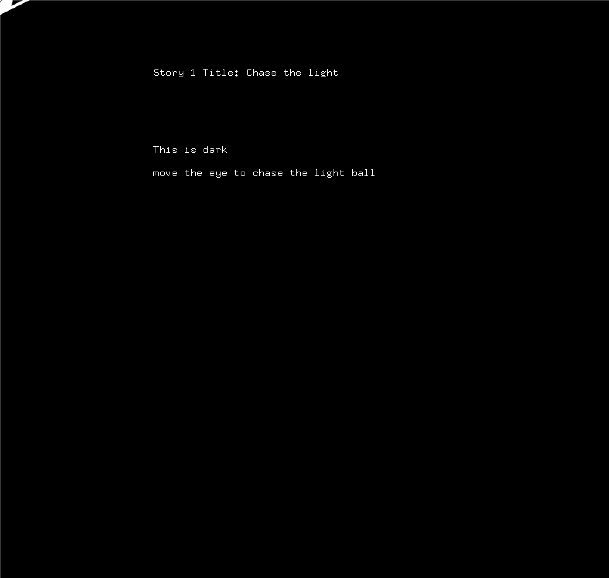
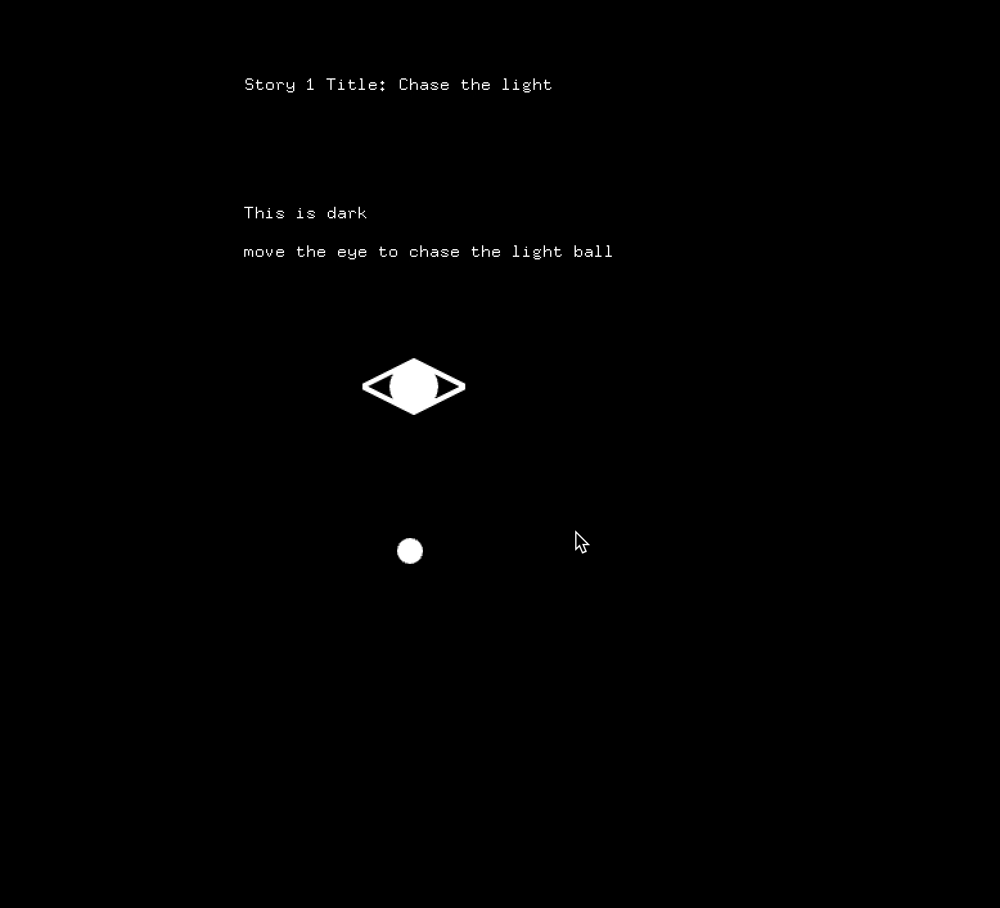

# Project1
## Project concept
### This project aims to tell a short story about an eye has born in the mother darkness and he wants to chase the light. One day, a light dot accidentally comes into his life and he starts to play with the light. In the end, he didn’t realize that light is Pandora’s box. He successfully touched the light, but there is no darkness anymore. 

### How you translated the concept into something concrete
  
 I am trying to use the simplest shapes and text descriptions to translate my concept. By building up scenes and change background music, I am wishing to provide a smooth storytelling experience to the audience.

### Process questions
  
 - how could I connect different scenes by different keyboard keys and timeframes?

### Screenshots
### brainstorm

 
### begin stage

 
### mouse click, a light ball appear

 

### mouse drag or move arrow, the eye move the desinated location

 

**Link to Youtube video:**

