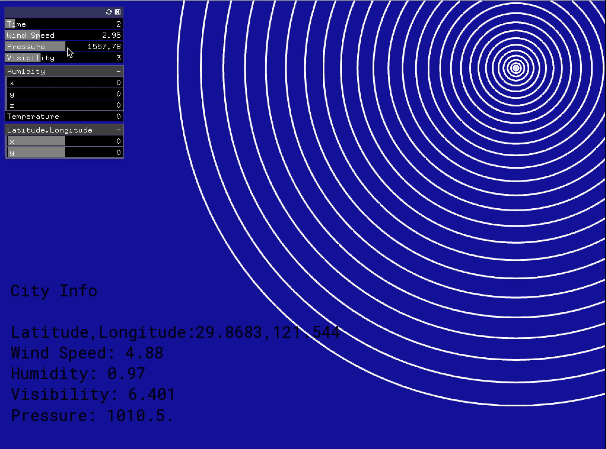

# Project2
## My Project2 is an extended version of my assignment8. Last time, I tried to visualize the data for my hometown city ningbo, and this time I am trying to see if I could abstract it more for all of the cities. This time the abstract circles are mainly controlled by the humidity and the pressure of the desired location, as the x and y on the screen are coordinated to the latitude and longitude of the location. The windspeed is represented by the music speed as the faster the wind, the faster the music.

### Screenshots
### The visbilties of the location controls the visbilities of the circles.

 
### The humidity of the locations controls the moving pattern of the circles.

 

### The transparency of the background is controlled by the pressure

 

### The background music volume is controlled by the windspeed

 

**Link to Youtube video:**

